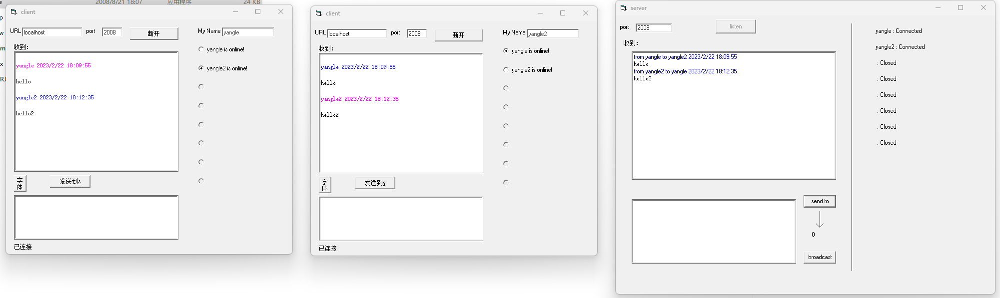

# 一封来自2007年的情书

今天收到一份编程挑战，大概要求是做一个聊天程序。

这不免让我想起2007年高中毕业的那个暑假，我用VB同样写着一个[聊天程序](download/vb聊天程序1.9.zip)。

更幸运的是，我找到了当时的源代码。

而且，2023年的今天，我的Windows 11还能直接[^1]运行当年的那个程序！

程序的现代定义可以说是，定义需求，实现功能，然后进行维护。

我不是从这里出发的。

也许很多人都忘了自己为什么出发，但我知道。

07年的那个暑假，那个程序才是我的起点，或者也许更早。

15年前我觉得，程序是艺术；现在我觉得，程序更是情感。

一个想用程序表达自己想法的人，代码就是他的文字。

现在这封信从遥远的过去送来，如今的程序没有这种功能。

作为回信，我想是时候把程序文档补上了...

## 功能介绍
- 支持联网，真正的跨网络通信
- 最多同时支持8人在线
- "正在输入..."提示
- QQ消息提示音
- 支持全屏沉浸式聊天
- 服务端广播功能
- 支持修改字体样式
- KB级超小程序体积
- 界面简洁

## 实现原理
基本的想法是简单的，对于一个聊天程序来说，最重要的东西是通信协议。

通信协议确定后，代码就不可能有本质的差别。本程序的通信协议是这样的

| 发送者 | 接收者 | 消息 | 含义 |
|--|--|--|--|
| C | S | \<null\> I am \<user-name\> | 用户注册 |
| S | C | \<null\> id \<user-id\> | 返回用户id |
| C | S | \<null\> list | 请求用户列表 |
| S | C | \<user-id\> User \<user-name\> is online! | 返回用户列表(多条消息) |
| S | C | \<user-id\> User \<user-name\> <null\> | 用户下线 |
| C | S | \<user-id\> msg \<my-name\> \<now-time\> \<msg-to-send\> | 发送消息
| S | C | \<user-id\> msg \<my-name\> \<now-time\> \<msg-to-send\> | 服务器转发消息
| C | S | \<user-id\> tip \<my-id\> | 正在输入提示
| S | C | \<user-id\> tip \<my-id\> | 服务器转发正在输入提示

整个消息是一个字符串，用不可见字符隔开各字段，这样做有很多好处。
- 无需考虑序列化和反序列化
- 消息解析极其简单
- 消息可读性强，易于调试
- 对程序要求少，只需支持字符串操作

[^1]: 只需以管理员权限运行regsvr32注册3个控件
