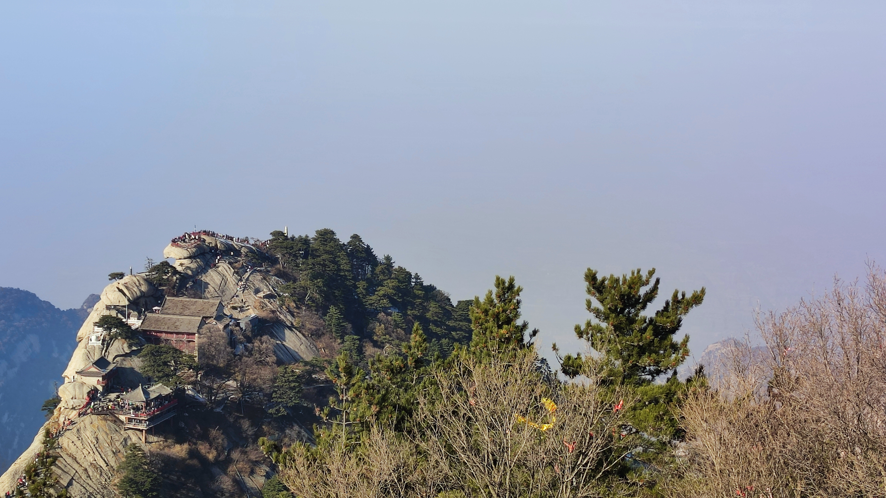

# 2023新春自驾游记

春节刚过，趁进入下一份工作的间隙，开车和爸妈一起出去转了一圈。我原计划的路线是这样的

实际上...

## 第一天

开车前往太行大峡谷，本想着是从峡谷里转一圈去长治住下。这里要说一下，太行大峡谷位于河南林州和山西壶关两县交界处，所以实际上是有两个大峡谷。我们顺利地到达了林州峡谷，然而在往后导航的时候，走错了路线，导致我们未能到达第二处峡谷。不过，误打误撞地，我们惊奇地走了一条刺激地山路，穽底挂壁公路。这是妈在车辆后排拍到的照片

不知道是不是导航偏差的原因，天黑之后我们才到长治市内住下。来到山西，当然要尝尝山西的面，但可能是我们没找对地方，反正，不太好吃...

## 第二天

离开长治，计划经壶口瀑布去往华山。壶口瀑布位于山西壶口县和陕西宜川县交界处，但不巧的是(可能)由于黄河冰冻断流的原因，壶口瀑布景区并未开放。在黄河两侧的公路上望了几眼之后，我们便继续赶路了。又是天黑之后，我们才到达华阴，因其南依华山而得名，山北为阴嘛。

到了陕西，当然是吃biangbiang面，结果跟网上说的一样，面少，还贵...

## 第三天

当然是登华山。我提前在网上做了攻略，知道爬山的路线大概是这样的。

实际上，我8点半从玉泉院出发到北峰只用了2个半小时。但由于后续体力不足，游览其余四峰用时较长，下午5点左右才得以从西峰索道下山回到住处。爸妈采取的是从西峰索道上山，北峰索道下山的游览方式，想必要轻松不少。

### 华山山门

### 最陡的一段

### 北峰顶

### 去往中锋的路上回望北峰(索道)

### 东峰附近的下棋亭

### 南峰附近的凌空栈道

### 从南峰望东峰下行的人群

### 从南峰望西峰

### 南峰(五岳最高峰)

### 西峰

### 于西峰索道拍摄

## 第四天

于湖北十堰休整半天，洗了洗衣服，没去武当山，原因很明显，爬山累了...

十堰这座小城嘛，楼倒是很高的

晚上饱餐一顿

## 第五天

早餐吃过热干面后，我们驱车去往宜昌。恰逢元宵节，虽说宜昌绿意盎然，但没有节日气氛。不过也正常，现在人们连春节都不过了，谁还管元宵节的事。

## 第六天

从宜昌市区去三峡大坝，沿途卡口众多，需要办理专门的通行证才可同行。好在每个卡口都可免费办理。然当日天公不作美，雾霾较重，未能一睹大坝清晰的容颜...

### 三峡船闸

### 三峡坝区的竹子

### 近看船闸区

毛主席诗云
<blockquote><pre>
  更立西江石壁
  截断巫山云雨
  高峡出平湖
  神女应无恙
  当惊世界殊
</pre></blockquote>

### 但今天什么都看不清啊

### 出入三峡(船闸)的船只

### 三峡大坝本体

### 坝区的...椰子树?

### 当年截流用的工程车

### 大坝另一侧

靠近坝区，电力供应和冷却用水都很充足，像这样的水电站附近有数据中心并不意外，在三峡坝区我就发现了一个，靠近宜昌市区也有不少。千岛湖和贵州的数据中心很多也是这种模式。

## 第七天

离开宜昌，我们改变了计划。一来贵州山高路远行车不便(来回2000多公里)，二来我们只租了15天车，也不想把旅行时间拖得太长。于是我们准备逐渐从东部往回走，而这返程的第一站，我们去了庐山...

庐山在江西，要从湖北黄梅县小池镇经九江长江大桥过到江那边去，我没想到的是，过这个桥居然要收费，将近10块钱... 这个被称为九江一桥的地方，肯定不是“一桥飞架南北，天堑变通途”的一桥...

桥这边还是湖北，桥那边便是江西了，不管怎么说，晚上我们终于赶到了九江市住了下来...

另外，到江南之后这几天就一直在下雨，后面几天一直都在下雨...

## 第八天

苏轼诗云
<blockquote><pre>
横看成岭侧成峰
远近高低各不同
不识庐山真面目
只缘身在此山中
</pre></blockquote>

在这个雨雾交加的天气，恐怕我们更看不清庐山的面目。不过我们还是如愿来到了庐山。

### 庐山东门

里面的一块石头上写的应该是紫气东来，是因为日照香炉生紫烟吗？

庐山的泉水是特别清澈的，透明见底的那种清澈，直接饮用的那种清澈。汇到潭中又变成一种蓝绿色，像宝石一样。

### 泉水和小潭

### 上游的大潭

### 庐山瀑布(三叠瀑)

李白诗云
<blockquote><pre>
日照香炉生紫烟
遥看瀑布挂前川
飞流直下三千尺
疑是银河落九天
</pre></blockquote>

今天没有紫烟，但是这个三千尺... 李白你是认真的吗?

<video src="../images/wx_camera_1675832243414.mp4" controls></video>

瀑布下方是个潭子，我沿着潭子往山上又爬了一段，路途实在太远，山也还很高，因为下午还要赶路，爬到一个红亭子处(不是视频中这个，那个在大概瀑顶的高度)便作罢回去了。

### 下山途中的别致小石门

## 第九天

我们来到了千岛湖。其实本来是想去黄山的，但大家看了这么多山也爬了不少，加上天气实在也不太行，就改到了离黄山也不远的千岛湖。

### 湖边的民居

我觉得这样的房子住着应该会很舒服，开放的阳台很便于呼吸新鲜空气...

### 从民居望向千岛湖的方向

水里的这块小渚像不像...鞋垫？

## 第十天

乌镇，一个名不符实的地方。可能是我们来的时间不对？

### 非景区

### 景区

## 第十一天

我们来到了安徽滁州，作为一个面食爱好者，来安徽必须吃板面。

欧阳修云
<blockquote><pre>
环滁皆山也
其西南诸峰
林壑尤美
望之蔚然而深秀者
琅琊也
</pre></blockquote>

然而有人生来就在罗马，比如在琅琊山景区住的这些居民

### 民居

### 醉翁亭记全文

### 竹子、竹子、还是竹子

欧阳修又云
<blockquote><pre>
山行六七里
渐闻水声潺潺
而泻出于两峰之间者
酿泉也
峰回路转
有亭翼然临于泉上者
醉翁亭也
</pre></blockquote>

### 醉翁亭(修院子围起来了)

### 酿(让)泉

醉翁亭再往上走，有琅琊寺。这个在欧阳修里的文章里没有记载，不过欧阳修说
> 作亭者谁？山之僧智仙也

也许这个智仙就来自琅琊寺？

### 琅琊寺

为了不原路返回，我们就继续向前寻路，没想爬到了山顶。更无奈的是，山顶往下路更远，我们不得已又原路返回。好在山不算高。

在离开滁州之前，我还打算去传说中的滁州西涧看看，韦应物诗云
<blockquote><pre>
独怜幽草涧边生
上有黄鹂深树鸣
春潮带雨晚来急
野渡无人舟自横
</pre></blockquote>

然而实际上，西涧湖现在是一个水库，且正在施工，无法观览，便作罢。

## 第十二天

往回走，进入山东，来到微山湖。微山湖位于枣庄和济宁微山县交界处，好在景区只有一个。需坐轮渡上岛。

### 迎接我们的轮渡

### 猜猜哪辆是我们的车

### 微山湖上运输货物的船队

### 铁道游击队纪念碑和纪念馆

### 登高看微山岛一角

一个哲学问题，坐轮渡算是坐车还是坐船？

<video src="../images/wx_camera_1676182670831.mp4" controls></video>

## 第十三天

终于到家，我得以写下这篇游记和总结行程。所以实际上我们的路线是这样的

下面是本次费用统计饼图，其中租车1000元，油费2000元，高速费2000元，住宿费2000元，景区门票1000元。

本次旅行历时12天，行程4300公里，3个人以总计不到9000元的费用圆满结束了旅程。
